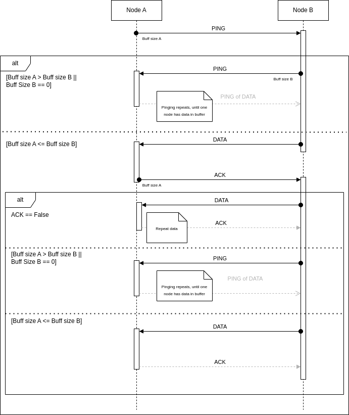
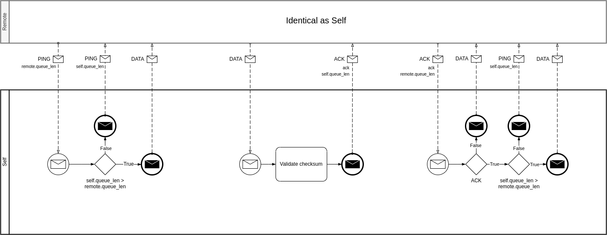

# Trough-air protocol (TAP) description
This section contains description of custom protocol used for communication
between nodes.

## Message types

### PING

PING message is used to comunicate message queue lengt between nodes. The node
with longer queue then sends data.

| Name         | Data Type  | Description                                         |
| :----------- | :--------- | :-------------------------------------------------- |
| Link Address | uint8_t[6] | Unique link address. Must be the same on both nodes |
| Message Type | uint8_t    | 0x01                                                |
| Queue Length | uint8_t    | Number of messages waiting for transmit             |
| CRC          | uint8_t    |                                                     |

### ACK

ACK message is used to confirm data reception. When CRC is not valid, ACK==false
is used to request data again. When ACK==true, remote node will act as with PING
message.

| Name         | Data Type  | Description                                         |
| :----------- | :--------- | :-------------------------------------------------- |
| Link Address | uint8_t[6] | Unique link address. Must be the same on both nodes |
| Message Type | uint8_t    | 0x02                                                |
| Message ID   | uint8_t    | Used for retry when ACK==false                      |
| ACK          | uint8_t    | Received message is valid                           |
| Queue Length | uint8_t    | Number of messages waiting for transmit             |
| CRC          | uint8_t    |                                                     |

### DATA

DATA message is used to carry actual payload. Because Mavlink packet can be up
to 282 bytes long and max LORA packet can have only 256 bytes, payload parting
sometimes is required.

| Name           | Data Type  | Description                                         |
| :-----------   | :--------- | :-------------------------------------------------- |
| Link Address   | uint8_t[6] | Unique link address. Must be the same on both nodes |
| Message Type   | uint8_t    | 0x04                                                |
| Message ID     | uint8_t    | Used for retry when ACK==false                      |
| Parting Flags  | uint8_t    | See parting flags section bellow                    |
| Part Number    | uint8_t    |                                                     |
| Data Length    | uint8_t    | Length of payload                                   |
| Payload        | uint8_t[]  |                                                     |
| CRC            | uint8_t    |                                                     |

#### Parting flags

| Bit  | Function  |
| :--- | :-------- |
| 0x01 | Has parts |
| 0x02 | Last part |

## Sequence of messages

Comunication starts with PING messages back and forth, unitil one of nodes has
data to send. Then on received PING message this node reply directly with DATA
message. Second node replies with ACK message.

If ACK==true, ACK message serves the same function as PING. If node, which
received ACK message as longer data queue than received in ACK message, replies
with next DATA. If not, the node replies with PING.

If ACK==false, which indicates some problem with data receive of validation,
DATA message is sent again.

This means, nodes are switching receiver/transmitter roles after each message.
If no message is received for configured timeout, node sends PING, as last
message was probably lost.

